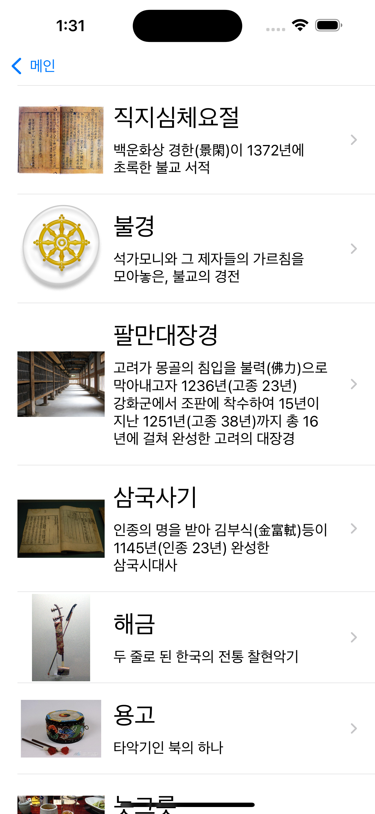

# 만국박람회 프로젝트

## 0. 목차
[1. 소개](#1-소개)  
[2. 팀원](#2-팀원)  
[3. 타임라인](#3-타임라인)  
[4. 실행 화면](#4-실행-화면)  
[5. 트러블 슈팅](#5-트러블-슈팅)  
[6. 팀 회고](#6-팀-회고)  
[7. 참고 자료](#7-참고-자료)  

## 1. 소개
이 앱은 1900 만국박람회를 테마로 한 정보 제공 앱입니다. 첫 화면은 박람회의 포스터와 관련 설명을 표시하며, 사용자는 여기서 출품작 목록으로 넘어갈 수 있습니다. 목록 화면에는 출품작의 사진, 이름, 간단한 설명이 포함되어 있고, 각 출품작을 클릭하면 상세 정보를 볼 수 있는 화면으로 이동합니다. 상세 화면에는 출품작의 이름, 사진, 그리고 자세한 설명이 표시됩니다. 이 앱은 박람회의 역사와 출품작의 매력을 현대적인 방식으로 소개하고자 합니다.

## 2. 팀원
| [햄찌](https://github.com/kkomgi) | [가마](https://github.com/forseaest) |
| --- | --- |
|  |  |

## 3. 타임라인
여기에 표현된 기능들을 날짜별로 세분화하여 타임라인 표를 작성해 보겠습니다:

| 날짜       | 수행 내용 |
|------------|------------------------------------------------------|
| 2024-03-04 | JSON 데이터와 매칭할 모델 타입 구현, Codable 채택 |
| 2024-03-05 | JSON 키 값 스네이크 케이스/축약형을 스위프트 네이밍으로 변환 |
| 2024-03-06 | 테이블뷰의 Delegate와 Data Source 역할 이해 |
| 2024-03-07 | 테이블뷰 셀의 재사용 메커니즘 이해 |
| 2024-03-08 | 테이블뷰 동작 방식 전반 이해 |
| 2024-03-09 | JSON 데이터 파싱하여 테이블뷰에 표시 구현 |
| 2024-03-10 | 내비게이션 컨트롤러를 사용한 화면 전환 구현 |
| 2024-03-11 | 뷰 컨트롤러 간 데이터 전달 로직 구현 |
| 2024-03-12 | 다양한 기기 대응을 위한 오토 레이아웃 적용 |
| 2024-03-13 | Word Wrapping/Line Wrapping/Line Break 방식 이해 |
| 2024-03-14 | 접근성 개념 이해 및 적용 |
| 2024-03-15 | Dynamic Types을 통한 텍스트 접근성 향상 구현 |

## 4. 실행 화면
### 4-1. 스크린샷
| 박람회 메인 화면 | 출품작 목록 화면 | 출품작 세부정보 화면 |
| --- | --- | --- |
|  |  |  |

### 4-2. 시연 영상
| 박람회 화면에서 출품작 목록 화면으로 이동 | 출품작 목록 화면에서 출품작 세부정보 화면으로 이동 |
| --- | --- |
|  |  |

## 5. 트러블 슈팅

### JSON 데이터 매칭 문제 해결

**문제**: 모델 타입이 JSON 구조와 정확히 일치하지 않음.

**해결**: `CodingKeys`를 사용하여 JSON 키와 모델 프로퍼티를 정확하게 매핑.

```swift
struct ExpoItem: Codable {
    let title: String
    let visitors: Int
    let location: String
    
    enum CodingKeys: String, CodingKey {
        case title
        case visitors = "visitor_count"
        case location
    }
}
```

### JSON 데이터 구조 변경 반영

**문제**: JSON 구조가 변경되어 기존 모델과 매치되지 않는 문제.

**해결**: 변경된 JSON 구조에 맞게 모델을 업데이트.

```swift
struct ExpoItem: Codable {
    let title: String
    let visitors: Int
    let description: String
    
    enum CodingKeys: String, CodingKey {
        case title
        case visitors = "visitor_count"
        case description = "description_text"
    }
}
```

### 내비게이션 데이터 전달 문제 해결

**문제**: 뷰 컨트롤러 간 데이터 전달이 제대로 이루어지지 않음.

**해결**: 적절한 데이터 전달 구현.

```swift
override func prepare(for segue: UIStoryboardSegue, sender: Any?) {
    if segue.identifier == "ShowDetail" {
        if let destinationVC = segue.destination as? DetailViewController {
            destinationVC.expoItem = selectedExpoItem
        }
    }
}
```

### 화면 전환 시 데이터 전달 로직 개선

**문제**: 리스트에서 상세 화면으로 넘어갈 때 데이터가 올바르게 전달되지 않음.

**해결**: prepare(for:sender:) 메서드에서 적절한 데이터 전달 로직 구현.

```swift
override func prepare(for segue: UIStoryboardSegue, sender: Any?) {
    if segue.identifier == "showDetailSegue" {
        if let indexPath = tableView.indexPathForSelectedRow,
           let detailVC = segue.destination as? DetailViewController {
            detailVC.expoItem = expoItems[indexPath.row]
        }
    }
}
```

### 테이블뷰 셀 세부 설정 개선

**문제**: 셀 내용이 적절히 표시되지 않는 문제.

**해결**: 셀 구성 로직에서 뷰 업데이트를 보장.

```swift
override func tableView(_ tableView: UITableView, cellForRowAt indexPath: IndexPath) -> UITableViewCell {
    let cell = tableView.dequeueReusableCell(withIdentifier: "ExpoCell", for: indexPath) as! ExpoTableViewCell
    let item = expoItems[indexPath.row]
    cell.configure(with: item)
    return cell
}
```

## 6. 팀 회고
| 햄찌 | 가마 |
| --- | --- |
| 이번 프로젝트를 진행하면서 많은 것을 배울 수 있었습니다. 특히, Codable을 사용하여 JSON 데이터와 모델을 매칭하는 부분에서 많은 어려움을 겪었습니다. 그러나 팀원 가마의 지원 덕분에 이를 극복할 수 있었습니다. 더불어, 테이블 뷰가 원활하게 작동하는 결과까지 완성할 수 있었습니다. 가마와 프로젝트를 진행하며 지식과 리더십을 배울 수 있어서 정말 감사했습니다. 함께하는 동안 많은 것을 얻을 수 있었고, 앞으로도 계속해서 함께 일하고 싶은 동료라는 생각이 들었습니다. | JSON 파싱할 때 케이스 별 예외 처리나 박람회 화면의 화면 이동 버튼 구현에 아쉬움이 남습니다. 텍스트 양 옆의 이미지와 이미지와 텍스트 사이의 공백을 누를 때에도 출품작 목록 화면으로 넘어갈 수 있도록 하고 싶었지만 아직 배움이 부족하여 구현하지 못했습니다. 이외에도 여러 아쉬운 점들이 남지만, 인터페이스 빌더를 통해 테이블 뷰를 구현하고 오토 레이아웃을 적용하여 화면을 만들 수 있는 단초를 다질 수 있어서 좋았습니다! |

## 7. 참고 자료
**1. UITableView**

* **링크**: [https://developer.apple.com/documentation/uikit/uitableview](https://developer.apple.com/documentation/uikit/uitableview)
* **설명**: 테이블 뷰의 기본 기능에 대한 설명

**2. UITableViewDataSource**

* **링크**: [https://developer.apple.com/documentation/uikit/uitableviewdatasource](https://developer.apple.com/documentation/uikit/uitableviewdatasource)
* **설명**: 테이블 뷰 데이터 소스 프로토콜에 대한 설명

**3. UITableViewDelegate**

* **링크**: [https://developer.apple.com/documentation/uikit/uitableviewdelegate](https://developer.apple.com/documentation/uikit/uitableviewdelegate)
* **설명**: 테이블 뷰 델리게이트 프로토콜에 대한 설명
