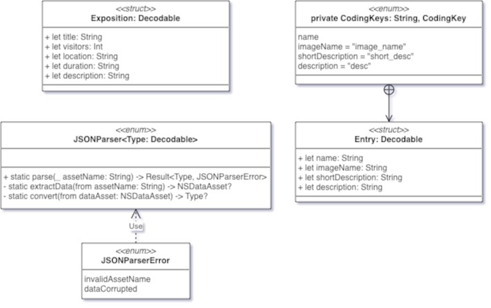

# iOS 커리어 스타터 캠프

## 만국박람회 프로젝트 저장소

### JSON 파일 -> asset catalog -> 인스턴스화

- JSON파일을 Exposition과 Entry 타입으로 파싱하기 위한 설계이다.

**고민했던 점**
- JSONParser 타입을 구현하는데, Type에 Array가 들어갈 수 있다는 것을 생각하지 못해서 한참 헤맸다.